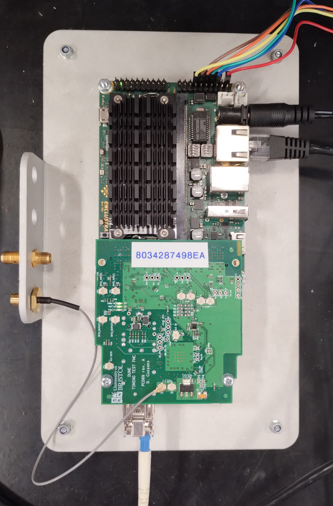

# uob-hep-pc069
DUNE Timing System Reference Hardware FMC. 

Successor to pc053a,c,d,e ( https://webapps-pp.bris.ac.uk/svn/uob-hep-pc053a/ )

Circuit schematic at https://github.com/uob-hep-cad/uob-hep-pc069/blob/main/hardware/Schematics/pc069a_toplevel.pdf

(N.B. Unlike pc053 , this design has no ADN2814 CDR )

List of changes w.r.t. pc053e at https://uob-my.sharepoint.com/:x:/g/personal/phdgc_bristol_ac_uk/Eb3lEkg4T_dNv52CUFCi3MEB-VoL37d42aNxBQbhaa6lCw?e=eADDgv (sorry, UoB only :-( )

Top level IPBus-Build (ipbb) dependency file for a design to act as a timing master when used in conjunction with a Digilent Nexys Video FPGA board can be found at https://gitlab.cern.ch/dune-daq/timing/dune-timing-firmware/-/blob/develop/projects/master/firmware/cfg/top_digilent_nexys_video_a200_pc069a.dep

Ready-built FPGA configuration file at https://pdts-fw.web.cern.ch/pdts-fw/index.php?p=mr%2F62%2Fpipeline4546347%2Fpackage&view=master_nexys_video_a200_pc069a_mr62_sha-c4552a0f_runner-slu9p8x4-project-19909-concurrent-2_220927_1856.tgz

Can use dtsbutler to control master design. 

See https://github.com/DUNE-DAQ/timing/wiki/Dune-Timing-System-Page-1 

.JPG)
*Top view of pc069a*

.JPG)
*Bottom view of pc069a*

*pc069a mounted on Enclustra PM3/AX3 FPGA board*

